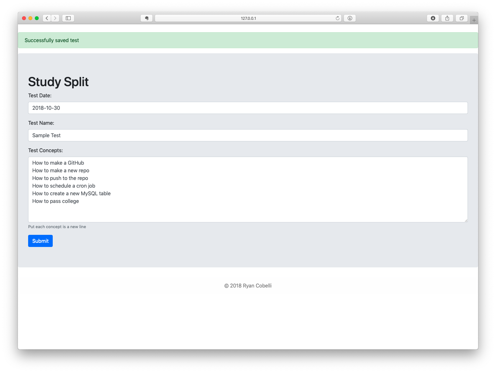

# StudySplit
##### A system that splits up how you need to review for upcoming tests

## How it works
Simply navigate to your local instance of the software and tell it when the test is and what you need to study. The system will split up the concepts so that you can review a bit every day leading up to the test. Every day that you have a concept to review, you'll get a new card added to Trello.

## Installation
1. Create a new table in your MySQL DB (see `table.txt` for create command)
2. Update the credentials in `init.php` (for Trello and the DB)
3. Place the code on a server capable of running PHP
4. Avoid procrastination on your future tests
